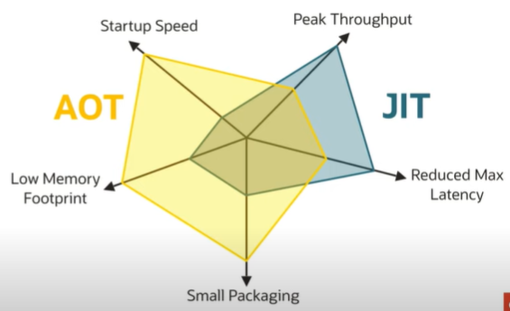

# graalvm-notes

* references
    * [New opportunities for Java developers with GraalVM - Oleg Šelajev](https://www.youtube.com/watch?v=hp-DekN3yMo)
    * [Particle Accelerators and Java with Quarkus - Burr Sutter](https://www.youtube.com/watch?v=KpS3-ZNeCfE)
    * [Micronaut, Dragon-Slayer (Spring/boot) or just another framework - Vladimir Dejanović](https://www.youtube.com/watch?v=utfX9jZmv2A)
    * [WJUG #254 - Robert Witkowski: Micronaut](https://www.youtube.com/watch?v=iviVLEqb5cA)
    * [Evolving Java for the Serverless Era with Micronaut by Graeme Rocher](https://www.youtube.com/watch?v=UjK7YY30Iuc)
    * [2019 - Maciej Przepióra - The need for speed. What is GraalVM and how can it help you?](https://www.youtube.com/watch?v=Cc2jLwNN8ts)
    * [Maximizing Applications Performance with GraalVM](https://www.youtube.com/watch?v=j9jIny7HsSo)
    * [Quarkus](https://www.youtube.com/watch?v=V6Dnz8wei44)
    * [Maximizing Performance with GraalVM](https://www.youtube.com/watch?v=o8Sir1cFhDc)
    * [Ahead of Time Data Access with Micronaut by Graeme Rocher](https://www.youtube.com/watch?v=CEXb6tnf-EI)
    * [Quarkus why, how and what by Emmanuel Bernard](https://www.youtube.com/watch?v=Us4gjBRJo1I)
    * [Abstractions Without Regret with GraalVM by Thomas Wuerthinger](https://www.youtube.com/watch?v=noX2uHA2Udo)
    * [GraalVM native images explained by Oleg Šelajev](https://www.youtube.com/watch?v=YvVnBOMi0Rs)
    * [Running Spring Boot applications as GraalVM native images by Sébastien Deleuze](https://www.youtube.com/watch?v=3eoAxphAUIg)
    * [Micronaut Deep Dive by Graeme Rocher](https://www.youtube.com/watch?v=S5yfTfPeue8)
    
# GraalVm
* fast java
* instant startup, low footprint
* polyglot
* ahead-of-time compilation
* hotSpot is optimised for data center deployments, not cloud
* is JIT compiler
* is written in java
* substrateVm & native-image
* partial escape analysis
    * even if object can escape the method, graalvm assumes that it won't and
    start to use normal escape analysis
    * if object is not on the heap but in the stack you could do more things
    * allows for
        * scalar replacement
        * lock elision
* closed-world principle
    * what is not known to be true, is false, so that absence of information is interpreted as negative information
    * When building a native executable, GraalVM operates with a closed world assumption. It analyzes the call tree 
    and removes all the classes/methods/fields that are not used directly.
* pros
    * startup speed
    * peak throughput
    * reduced max latency
    * small packaging
    * low memory footprint
* java dynamic execution
    
* native image build process
    
* AOT
    * introduce and "extra" step to generate native code before deploying app
        * eg run jaotc command to convert class files to a platform specific "shared object"
        * akin to approach taken by less dynamic languages: c, cpp, rust
    * two deployment options (decided at build time)
        * no jit at runtime: statically compiled code runs, anything else interpreted
        * with jit at runtime: runtime jit (re)compiles via triggers or heuristics
    * some runtime advantages over jit
        * compiled code perfomance "immediately" (no wait to compile)
        * star-up performance can be 20-50% better especially if compined with AppCDS
        * reduces cpu & memory impact of jit compiler
    * load exectable with prepared heap
    * immediately start with best machine code
    * no longer platform neutral
        * different aot code needed for each deployment platform (linux, mac, windows)
    
* aot vs jit
     
* heap and state can be captured by the graalvm native-image compiler
    [alt text](img/graalvm/image_heap_compilation.png)
    * image heap
        * execution at run time start with an initial heap: the "image heap"
            * objects are allocated in the jvm vm that runs the image generator
            * heap snapshotting gathers all objects that are reachable at run time
        * do things once at build time instead at every application startup
            * class initializers, initializers for static and static final fields
            * class initialization at image build time improves app startup
                * by default, app classes are initialized at runtime
                * most jdk classes are initialized at image build time
        * examples for objects in the image heap
            * java.lang.Class objects, enum constants
    * default: image build fails when a reachable class is missing
        * guarantees no linking errors at runtime
* compilation pipelines
    * OpenJDK default
        * javac => interpreter => C1 JIT => C2 JIT
    * GraalVM JIT mode
        * javac => interpreter => C1 JIT => GraalVM JIT
    * GraalVM AOT mode
        * javac => GraalVM AOT
* why lower memory footprint in AOT?
    * no meta-data for dynamically loaded classes
    * no profiling data
    * no JIT compiler data structures
    * no dynamic code cache
* GraalVM native use non-parallel gc
* could be used instead as JIT C2

# quarkus
* like spring boot
* why? jvm & frameworks init on start-up -> high memory consumption & long start-up time
    * problematic if cloud
* start-up + first response
    * quarkus + openjdk - 2.5 seconds
    * quarkus + GraalVm - 0.055 seconds
* applicable for serverless
* under the hood
    * SubstrateVm
        * superpower: dead code elimination
        * for example: if you use hibernate and not use oracle - you don't need around 100 classes
        * analysis a whole graph of app and delete not used code
* hot reload
    * quarkus:dev makes quarkus run in dev mode and provide hot-reload capabilities
    * changes made to source and configuration files are automatically re-compiled once the
    browser is refreshed
* perfect fit for serverless/event-driven environments where we need to spin up
a service in real time to react to an event
* statically compiled executables benefit from close-world optimizations, such as fine-grained
dead-code elimination, where only the portions of frameworks (including the JDK itself) actually
in use by the service are included in the resulting image
* supersonic?
    * fast boot
* subatomic?
    * low memory, high density
* fast boot time = instant scale up
* how a traditional stack works
    1. search for configuration files, parse them
    1. classpath scanning to find annotated classes
        * discover extension points, plugins, optional features
    1. build the metamodel
        * prepare injection points
        * generate proxies
        * enhance classes
        * validate the world
* jandex - high performance classpath scanner & indexer: avoids any class initialization
* arc - CDI based dependency injection, at build time
* gizmo - bytecode generation library, used by extensions to generate all infrastructure
* makes a difference if we only want to scale in cloud - and we want to have low first response time

# micronaut
* a modern, jvm-based, full-stack framework for building modular, easily testable
microservice and serverless applications
* designed from the ground-up for Microservices and Serverless Computing
    * designed with microservices and cloud computing in mind with a lot of
    cloud-native features like
        * service discovery
        * distributed tracing
        * asynchronous communication
        * retriable http clients
        * circuit breakers
        * scalability and load balancing
        * external configuration
* library/toolkit vs framework
    * When you use a library, you are in charge of the flow of the application. 
        * You are choosing when and where to call the library. 
    * When you use a framework, the framework is in charge of the flow. 
        * It provides some places for you to plug in your code, but it calls the code you plugged in as needed.
* price to pay for spring boot: memory, cpu, start-up
    * because of proxies, injections, reflections, scan all the code etc
* reflection based approach to DI/AOP
    * no common reflection cache in java, each library/framework produces a unique reflection cache
        * this makes it extremely difficult to optimize memory consumption
    * reflective calls are difficult for the JIT to optimize
    * traditional AOP has heavy reliance on runtime proxy creation which slows
    app performance, makes debugging harder and increases memory consumption
* micronaut compile-time approach to DI/AOP
    * it processes classes at compile time and produces all metadata at compile time
    * doesn't need to scan all your classes, methods, properties to "understand" your app
    * uses Ahead of Time (AOT) compilation via annotation processors or AST transforms for groovy
    * pros
        * improves startup perfomance
        * reduces memory consumption
        * reducing proxies and stack trace size
        * improving debugging
* a microservices and serverless focused framework
* a complete application framework for any type of app
* dependency injection, AOP, configuration management, etc...
* reflection free, runtime proxy free, no dynamic classloading
* existing data access solutions
    * spring data, gorm etc
    * rely heavily on reflection and runtime proxies
    * must compute queries at runtime
    * cost of computation grows as your application grows
* micronaut data
    * precomputes queries at compilation time
    * uses micronaut's reflection-free aop
    * zero runtime overhead database access solution
    * compilation time checking
    * smaller stack traces
    * jpa-ql and sql currently supported
* solutions
    * problem: limited annotation API
        * solution: precomputed AnnotationMetadata
    * problem: type erasure
        * solution: precomputed Argument Interface
    * problem: slow reflection
        * solution: eliminate reflection
    * problem: reflective data caches
        * solution: zero data caches
    * problem: classpath scanning
        * solution: no classpath scanning
    * problem: slow dynamic class loading
        * solution: no dynamic class loaders