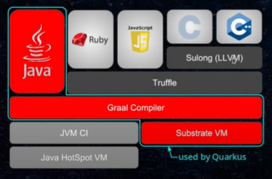

[](https://www.gnu.org/licenses/gpl-3.0)

# graalvm-notes
* references
    * [New opportunities for Java developers with GraalVM - Oleg Šelajev](https://www.youtube.com/watch?v=hp-DekN3yMo)
    * [Particle Accelerators and Java with Quarkus - Burr Sutter](https://www.youtube.com/watch?v=KpS3-ZNeCfE)
    * [Micronaut, Dragon-Slayer (Spring/boot) or just another framework - Vladimir Dejanović](https://www.youtube.com/watch?v=utfX9jZmv2A)
    * [WJUG #254 - Robert Witkowski: Micronaut](https://www.youtube.com/watch?v=iviVLEqb5cA)
    * [Evolving Java for the Serverless Era with Micronaut by Graeme Rocher](https://www.youtube.com/watch?v=UjK7YY30Iuc)
    * [2019 - Maciej Przepióra - The need for speed. What is GraalVM and how can it help you?](https://www.youtube.com/watch?v=Cc2jLwNN8ts)
    * [Maximizing Applications Performance with GraalVM](https://www.youtube.com/watch?v=j9jIny7HsSo)
    * [Quarkus](https://www.youtube.com/watch?v=V6Dnz8wei44)
    * [Maximizing Performance with GraalVM](https://www.youtube.com/watch?v=o8Sir1cFhDc)
    * [Ahead of Time Data Access with Micronaut by Graeme Rocher](https://www.youtube.com/watch?v=CEXb6tnf-EI)
    * [Quarkus why, how and what by Emmanuel Bernard](https://www.youtube.com/watch?v=Us4gjBRJo1I)
    * [Abstractions Without Regret with GraalVM by Thomas Wuerthinger](https://www.youtube.com/watch?v=noX2uHA2Udo)
    * [GraalVM native images explained by Oleg Šelajev](https://www.youtube.com/watch?v=YvVnBOMi0Rs)
    * [Running Spring Boot applications as GraalVM native images by Sébastien Deleuze](https://www.youtube.com/watch?v=3eoAxphAUIg)
    * [Micronaut Deep Dive by Graeme Rocher](https://www.youtube.com/watch?v=S5yfTfPeue8)
    * [Twitter's quest for a wholly Graal runtime - Voxxed Days Singapore 2019](https://www.youtube.com/watch?v=TbUahT0jet0)
    * [New opportunities for Java developers with GraalVM. Alina Yurenko, Oracle](https://www.youtube.com/watch?v=FenOzLslj4c)
    * [Quarkus and GraalVM: booting Hibernate at supersonic speed, subatomic size by Sanne Grinovero](https://www.youtube.com/watch?v=za5CSBX-UME)
    * [GOTO 2020 • Maximizing Java Application Performance with GraalVM • Oleg Šelajev](https://www.youtube.com/watch?v=PeMvksAZbdw)
    * [Deep dive into using GraalVM for Java and JavaScript developers by Oleg Šelajev, Thomas Wuerthinger](https://www.youtube.com/watch?v=a-XEZobXspo)
    * https://www.stefankrause.net/wp/?p=64
    * https://www.ibm.com/developerworks/java/library/j-jtp09275/index.html
    * https://www.graalvm.org/reference-manual/native-image/SubstrateVM/
    * https://medium.com/graalvm/improving-performance-of-graalvm-native-images-with-profile-guided-optimizations-9c431a834edb
    * https://en.wikipedia.org/wiki/Ahead-of-time_compilation
    * https://medium.com/@sauravomar01/ahead-of-time-vs-just-in-time-in-java-8456f5a77e00
    * https://stackoverflow.com/questions/46579565/is-ahead-of-time-compilation-available-in-java-9
    * https://en.wikipedia.org/wiki/GraalVM
    * https://www.beyondjava.net/truffle-compiler-compiler
    * https://en.wikipedia.org/wiki/Partial_evaluation
    
## general
* hotSpot is optimised for data center deployments, not cloud
    * we need instant startup and low footprint today
* GraalVM offers both a JIT compiler and an AOT compiler for Java
    * interpreter vs compiler
        * in a nutshell: compiler runs in advance, whereas the interpreter 
        works on-the-fly
        * interpreter reads program line-by-line and generates the machine code of the line on-the-fly
            * it forgets about the previous line, so loops are translated time and again to machine code
* polyglot
    
* written in java
    * integration with VM using JVMCI (jvm compiler interface - available since java 9)
    * truffle context
        * a language abstract syntax tree interpreter which allows implementing languages 
        on top of the GraalVM
        * it's an API providing everything you need to write an interpreter, plus a framework 
        allowing you to leverage partial evaluation
            * Futamura projections
* pros
    * startup speed
    * peak throughput
    * reduced max latency
    * small packaging
    * low memory footprint
* compilation pipelines
    * OpenJDK default
        * javac => interpreter => C1 JIT => C2 JIT
    * GraalVM JIT mode
        * could be used as JIT C2
        * javac => interpreter => C1 JIT => GraalVM JIT
    * GraalVM AOT mode
        * javac => GraalVM AOT
* vs C2
    * easier to understand
    * modular design
    * better inlining and escape analysis
        * even if object can escape the method, graalvm assumes that it won't and start to use normal escape analysis
        * if object is not on the heap but in the stack you could do more things
        * allows for
            * scalar replacement
                * when an object is identified as non-escaping the JVM can replace its allocation on the heap 
                with an allocation of its members on the stack which mitigates the lack of user guided 
                stack allocation
            * lock elision

## ahead of time compilation (AOT)
* is the act of compiling a higher-level programming language such as C or C++, or an intermediate representation 
such as Java bytecode into a native (system-dependent) machine code so that the resulting binary file can 
execute natively
* aot vs jit
     
    * default: image build fails when a reachable class is missing
        * guarantees no linking errors at runtime
* is enabled in Java 9
    * jaotc compiler
* potential risk - static initializers are resolved at compile time
    ```
    class HelloCachedTime {
        static final Date CACHED_TIME = Startup.TIME;
        
        public static void main(String args[]) {
            System.out.println("Startup: " + CACHED_TIME);
            System.out.println("Now: " + new Date());
        }
    
    }
    
    class Startup {
        static final Date TIME = new Date();
    }
    ```
    * javac HelloCachedTime.java, java HelloCachedTime
        ```
        Startup: Fri Aug 31 13:17:05 PDT 2018
        Now: Fri Aug 31 13:17:05 PDT 2018
        ```
    * native-image HelloCachedTime, ./hellocachedtime
        ```
        Startup: Fri Aug 31 13:22:12 PDT 2018
        Now: Fri Aug 31 13:17:05 PDT 2018
        ```
        * remedy: use flag `--delay-class-initialization-to-runtime=class`
## native images
* single, self-contained executable
     * contains all the application code as well as necessary runtime support, ex. the garbage collector
        * image build fails when a reachable class is missing
            * guarantees no linking errors at runtime
     * easily copied
     * no need to seek for various JAR, properties & other miscellaneous files and wait for them to 
     open, load and initialize
     * gives us instant startup
* able to capture a snapshot of an application memory
    * when native executable is started it continues exactly from where it was (snapshot)
    * eliminates repetitive initialization
        * makes the startup time even more instant
            * class initializers, initializers for static and static final fields
            * class initialization at image build time improves app startup
                * by default, app classes are initialized at runtime
                * most jdk classes are initialized at image build time
    * do things once at build time instead at every application startup
    * examples for objects in the image heap
        * java.lang.Class objects, enum constants
* lower memory consumption
    * closed-world principle
        * what is not known to be true, is false
            * absence of information is interpreted as negative information
        * analysis needs to see all bytecode
            * otherwise aggressive AOT optimizations are not possible
            * otherwise unused classes, methods, and fields cannot be removed
            * otherwise a class loader / bytecode interpreter is necessary at runtime
        * when building a native executable, GraalVM operates with a closed world assumption
            * it analyzes the call tree and removes all the classes/methods/fields that are not used directly
    * no meta-data for dynamically loaded classes
    * no profiling data
    * no JIT compiler data structures
    * no dynamic code cache
* trade-offs
    * can only run on a single platform
        * if you generate the image for 64-bit Linux, it only runs on Linux
        * portability is restricted compared to classical JAR file
    * ability to perform reflection is limited
        * is still possible, but it has to be configured and compiled into the native executable
    * no dynamic classloading (everything is known at compile time)
        * no dynamic proxies
    * when the application runs for a long time, the just-in-time compiler can actually outperform the AOT one
        > On the other hand, everything is always a tradeoff. Long running applications on traditional JVMs are 
        still demonstrating better performance than GraalVM native executables due to runtime optimization. 
        The key word here is long-running; for short-running applications like serverless functions, native 
        executables have a performance advantage. So, you need to decide yourself between fast startup time 
        and small size (and the additional step of building the native executable) versus better performance 
        for long-running applications.
                                                                                                                   
        > heliodon.io team
    * GraalVM native use non-parallel gc
* native image build process

    
    
    
* SubstrateVm
    * native image tool (part of GraalVM) which focuses on AOT compilation
    * takes a regular Java application and compile it into native binary
    * re-implementation of the JVM on a completely different basis
        * produces small, HotSpot independent code that starts fast and runs well in cloud based environment

## quarkus
* price to pay for spring boot: memory, cpu, start-up
    * because of proxies, injections, reflections, scan all the code etc
* supersonic?
    * fast boot
* subatomic?
    * low memory, high density
* why? 
    * high memory consumption & long start-up time is problematic if cloud
* start-up + first response
    * spring boot + openjdk - 5 seconds
    * quarkus + openjdk - 2.5 seconds
    * quarkus + GraalVm - 0.055 seconds
* applicable for serverless
    * perfect fit for event-driven environments where we need to spin up
    a service in real time to react to an event
    * fast boot time = instant scale up
    * makes a difference if we only want to scale in cloud - and we want to have low first response time
* under the hood
    * SubstrateVm
        * superpower: dead code elimination
            * analysis a whole graph of app and delete not used code
            * only the portions of frameworks (including the JDK itself) actually
            in use by the service are included in the resulting image            
            * for example: if you use hibernate and not use oracle - you don't need around 100 classes
* hot reload
    * `quarkus:dev` provides hot-reload capabilities
    * changes made to source and configuration files are automatically re-compiled once the
    browser is refreshed
* how a traditional stack works
    1. search for configuration files, parse them
    1. classpath scanning to find annotated classes
        * discover extension points, plugins, optional features
    1. build the metamodel
        * prepare injection points
        * generate proxies
        * enhance classes
        * validate the world
* jandex - high performance classpath scanner & indexer: avoids any class initialization
* arc - CDI based dependency injection, at build time
* gizmo - bytecode generation library, used by extensions to generate all infrastructure

## micronaut
* a microservices and serverless focused framework
    * library/toolkit vs framework
        * when you use a library, you are in charge of the flow of the application
            * you are choosing when and where to call the library
        * when you use a framework, the framework is in charge of the flow
            * it provides some places for you to plug in your code, but it calls the code you plugged 
            in as needed
    * reflection free, runtime proxy free, no dynamic classloading
* designed from the ground-up for Microservices and Serverless Computing
    * a lot of cloud-native features
        * service discovery
        * distributed tracing
        * asynchronous communication
        * retriable http clients
        * circuit breakers
        * scalability and load balancing
        * external configuration
* DI/AOP approach
    * reflection based
        * no common reflection cache in java, each library/framework produces a unique reflection cache
            * extremely difficult to optimize memory consumption
        * reflective calls are difficult for the JIT to optimize
        * traditional AOP has heavy reliance on runtime proxy creation
            * slows app performance
            * makes debugging harder
            * increases memory consumption
    * micronaut
        * processes classes at compile time and produces all metadata at compile time
        * doesn't need to scan all your classes, methods, properties to "understand" your app
        * uses Ahead of Time (AOT) compilation via annotation processors
        * pros
            * improves startup perfomance
            * reduces memory consumption
            * reducing proxies and stack trace size
            * improving debugging
* data access approach
    * existing data access solutions
        * spring data, gorm etc
        * rely heavily on reflection and runtime proxies
        * must compute queries at runtime
        * cost of computation grows as your application grows
    * micronaut
        * precomputes queries at compilation time
        * uses micronaut's reflection-free aop
        * zero runtime overhead database access solution
        * compilation time checking
        * smaller stack traces
        * jpa-ql and sql currently supported
* solutions
    * problem: limited annotation API
        * solution: precomputed AnnotationMetadata
    * problem: type erasure
        * solution: precomputed Argument Interface
    * problem: slow reflection
        * solution: eliminate reflection
    * problem: reflective data caches
        * solution: zero data caches
    * problem: classpath scanning
        * solution: no classpath scanning
    * problem: slow dynamic class loading
        * solution: no dynamic class loaders
